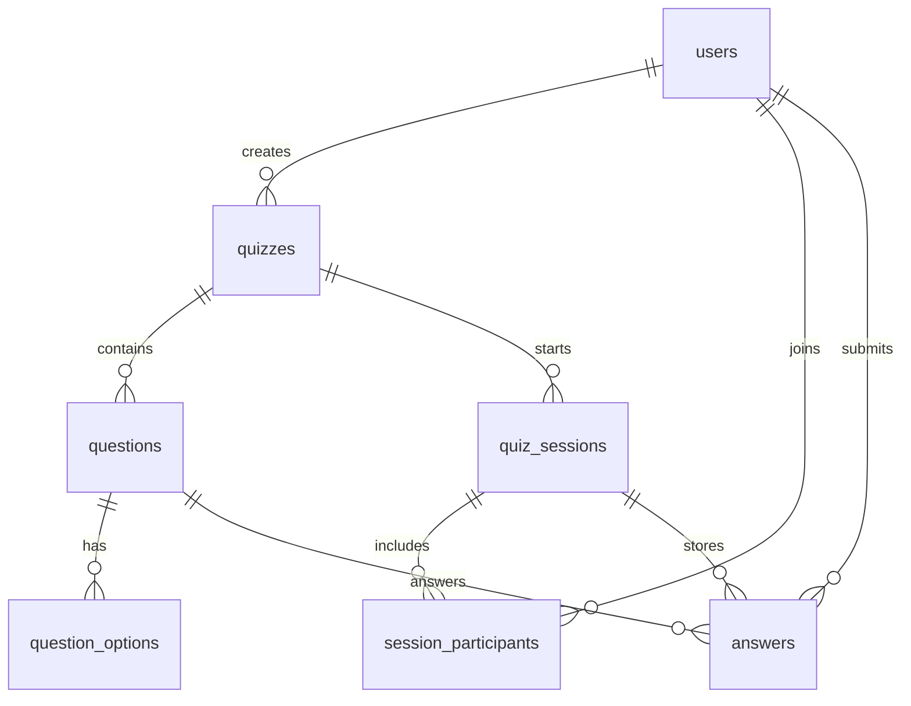

# Database Model

Этот файл закрывает шаг 2 из алгоритма: проектирование модели данных.

## Основные сущности

- `users`: участники и организаторы
- `quizzes`: квизы, созданные организаторами
- `questions`: вопросы квиза
- `question_options`: варианты ответов
- `quiz_sessions`: запуски квизов (комнаты)
- `session_participants`: участники конкретной сессии и их суммарные баллы
- `answers`: ответы участников по каждому вопросу

## ER-диаграмма

## Ключевые ограничения

- `users.email` уникален
- `quiz_sessions.room_code` уникален
- `questions(quiz_id, position)` уникален
- `session_participants(session_id, user_id)` уникален
- `answers(session_id, user_id, question_id)` уникален
- все внешние ключи включены (`PRAGMA foreign_keys = ON`)

## Реализация

Схема создается автоматически при запуске сервера:
- `server/src/db.js`
